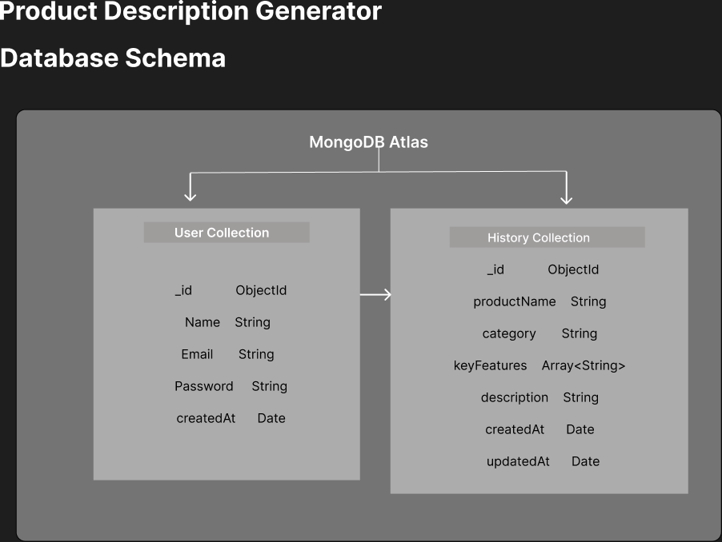

# Product Description Generator

A full-stack web application that generates AI-powered product descriptions for food products. The application uses a React frontend, an Express.js backend, and MongoDB Atlas for persistent data storage.

---

## Features

- Generate AI-powered product descriptions
- Save generated descriptions to MongoDB
- View all generated descriptions
- Search descriptions by product name
- Update saved descriptions
- Delete descriptions
- Responsive user interface


---

## Database Choice

This project uses **MongoDB Atlas** as the database.

MongoDB was selected because the application stores product description history as document-based data. Its flexible schema makes it easy to manage product information while Mongoose provides a simple way to perform CRUD operations from the Express backend.

---

## Database Schema

The following diagram represents the database structure used in this project.



---

## Project Structure

```text
Product-description-generator/
│
├── backend/
│   ├── controllers/
│   ├── middleware/
│   ├── models/
│   ├── routes/
│   ├── server.js
│   ├── package.json
│   ├── .env.example
│
├── frontend/
│   ├── src/
│   ├── public/
│
├── images/
│   └── schema-diagram.png
│
└── README.md
```

---

## Set Up the Database

This project uses **MongoDB Atlas**.

### 1. Clone the Repository

```bash
git clone https://github.com/nandini576/Product-description-generator.git
```

### 2. Install Backend Dependencies

```bash
cd backend
npm install
```

### 3. Configure Environment Variables

Create a `.env` file inside the **backend** folder.

Example:

```env
PORT=5000
MONGO_URI=your_mongodb_connection_string

```

> **Note:** Do not commit your `.env` file. Use the provided `.env.example` as a template.

### 4. Start the Backend Server

```bash
npm run dev
```

The backend runs on:

```
http://localhost:5000
```

---

## Run the Frontend

### 1. Navigate to the frontend folder

```bash
cd frontend
```

### 2. Install dependencies

```bash
npm install
```

### 3. Start the React application

```bash
npm run dev
```

The frontend runs on:

```
http://localhost:5173
```

---

## Available API Endpoints

| Method | Endpoint | Description |
|--------|----------|-------------|
| GET | `/` | Health Check |
| POST | `/api/generate` | Generate Product Description |
| POST | `/api/history` | Create History |
| GET | `/api/history` | Get All History |
| GET | `/api/history/:id` | Get History by ID |
| PUT | `/api/history/:id` | Update History |
| DELETE | `/api/history/:id` | Delete History |
| GET | `/api/history/search?q=` | Search History |

---

## Environment Variables

Create a `.env` file inside the backend folder.

```env
PORT=5000
MONGO_URI=your_mongodb_connection_string

```

An example configuration is provided in **backend/.env.example**.


---


# Deployment

## Live Frontend URL

https://product-description-generator-2g2n.vercel.app

## Live Backend URL

https://product-description-generator-gt6k.onrender.com

---

# Tech Stack Summary

### Frontend
- React.js
- React Router
- Tailwind CSS
- Axios
- React Hot Toast

### Backend
- Node.js
- Express.js
- Passport.js (Google OAuth 2.0)
- JWT Authentication
- Express Validator
- CORS

### Database
- MongoDB Atlas
- Mongoose

### AI Integration
- Google Gemini API (gemini-2.5-flash)

### Deployment
- Frontend: Vercel
- Backend: Render
- Database: MongoDB Atlas

---

# Known Limitations (Free Tier)

- Render free web services automatically spin down after a period of inactivity.
- The first request after the service has been idle may take **30–60 seconds** while the backend wakes up.
- If the backend is sleeping, login, Google OAuth, and AI generation may be delayed until the server becomes active.
- Vercel serves the frontend instantly, but it depends on the backend being awake for API requests.

---

